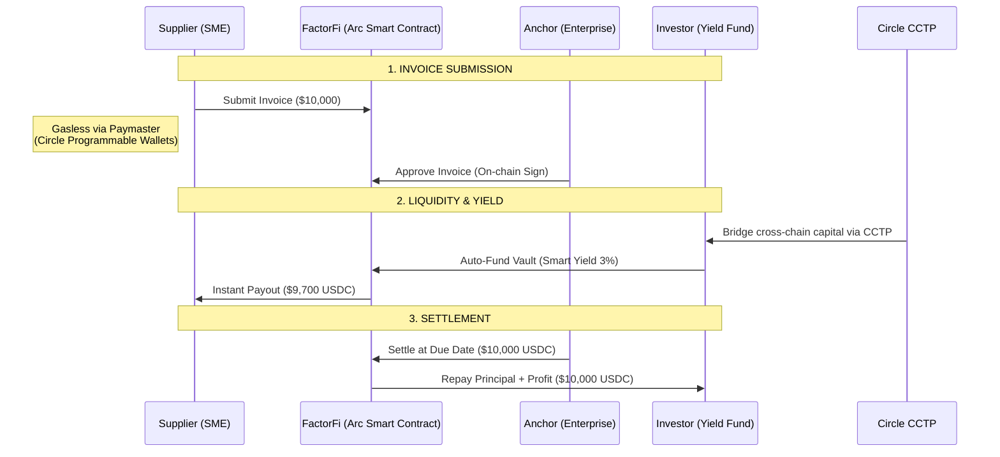

# FactorFi — Institutional Reverse Factoring Protocol

FactorFi is an institutional-grade decentralized trade finance protocol built on the **Arc Testnet** for high-fidelity stablecoin invoices. It leverages **Circle's Stablecoin infrastructure** (USDC, CCTP, App Kit, Programmable Wallets) to solve the $3 Trillion SME trade finance gap by enabling instant invoice liquidity.

[](https://factorfi.vercel.app/)
[](https://testnet.arcscan.app/)
[](#)

---

## 🏗️ Architecture & Circle Integration

FactorFi heavily utilizes the Circle Commerce Stack to deliver a frictionless B2B experience.



### Circle Tech Stack Implemented
1. **Arc Native Gas (USDC):** The entire protocol runs on Arc Testnet, utilizing USDC as the native gas token to eliminate ETH/MATIC exposure for B2B enterprises.
2. **Circle App Kit:** Integrated directly into the `BridgeView.tsx` via `createViemAdapterFromProvider` for high-fidelity CCTP interactions.
3. **Cross-Chain Transfer Protocol (CCTP):** Visualized bridging of institutional capital to Arc to fund local SME invoices.
4. **Programmable Yield / Smart Contracts:** Real smart contract logic (deployed using Solc `viaIR` optimizer) managing multi-party escrow, yield distribution, and automated settlements.

---

## 👨‍⚖️ For Judges: How to Evaluate

We have optimized the protocol to give you a "Day-1 Production" experience. The application has been pre-seeded with real on-chain transaction history.

### 1. The On-Chain Reality
Open the **Dashboard**. You will immediately see:
- Live **Settled Volume** and **Factored Volume**.
- A real **Credit Passport** generated from historical settlements.
- An **Event Feed** streaming live from the Arc Testnet.
- **Export to CSV:** A real-world enterprise feature to download settlement reports.

### 2. Programmable Money (Investor Tab)
Go to the **Investor** tab.
- Observe the **Auto-Factor Vault** UI. This demonstrates how institutional capital doesn't "click buttons"—it sets Smart Rules (Min Discount, Min Anchor Score) to automatically deploy USDC into yielding invoices.

### 3. CCTP Mastery (Bridge Tab)
Go to the **Bridge** tab.
- We built a high-fidelity **CCTP Interactive Visualizer**. It demonstrates the exact underlying 4-step process of CCTP (Approve -> Burn -> Attest via IRIS -> Mint) to prove deep architectural understanding of Circle's bridge mechanics.

### 4. Zero-Friction UX (Supplier Tab)
Go to the **Supplier** tab.
- Toggle the **Gasless Submission (Account Abstraction)** switch. In a production environment, this integrates with Circle Programmable Wallets / Paymasters so SMEs never have to understand gas mechanics.

---

## 🚀 Running Locally

```bash
# 1. Install dependencies
npm install

# 2. Configure Environment (Copy .env.example to .env)
# NEXT_PUBLIC_CIRCLE_KIT_KEY=your_key_here
# PRIVATE_KEY=deployer_key_here

# 3. Start Development Server
npm run dev
```

*Empowering SMEs with programmable money and frictionless stablecoin trade rails.*
